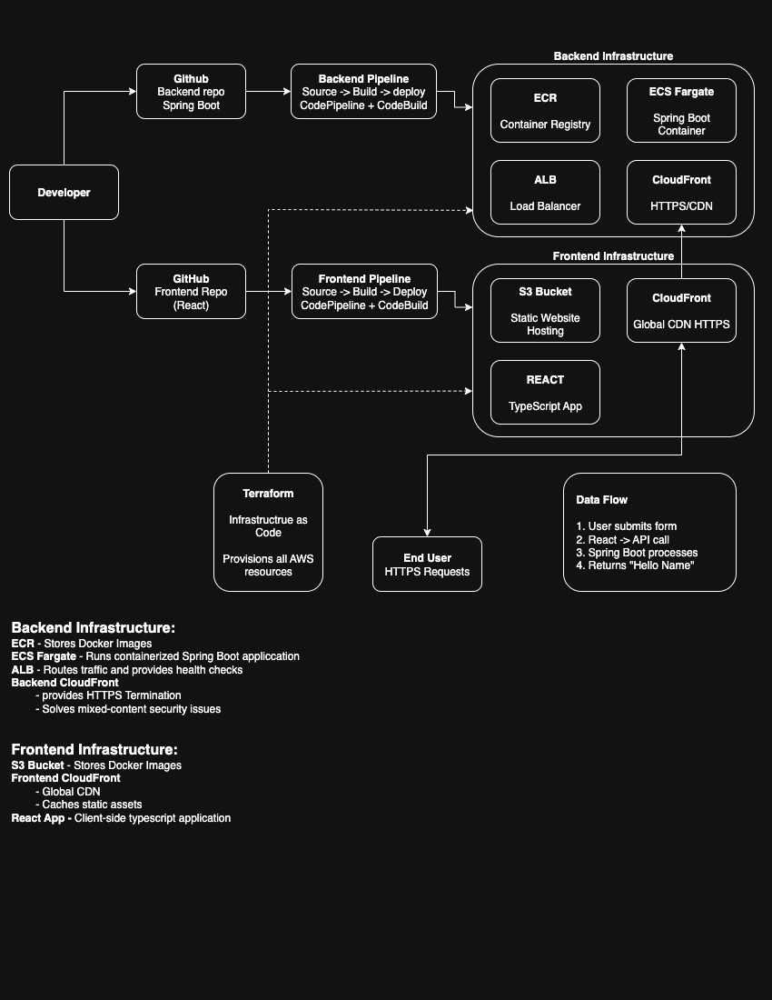

# Proof of Concept - Frontend

## Overview

This proof of concept demonstrates a complete full-stack application deployment pipeline using AWS services, Terraform infrastructure as code, and automated CI/CD workflows. The frontend and backend applications are intentionally kept as simple as possible while still enabling meaningful communication between the two layers.

### System Architecture

This frontend repository is part of a 3-repository system:

- ** [proof-of-concept-infrastructure](https://github.com/tsilvestri-slalom/proof-of-concept-infrastructure)** - Terraform IaC (deploy this FIRST)
- ** [proof-of-concept-backend](https://github.com/tsilvestri-slalom/proof-of-concept-backend)** - Java Spring Boot API
- ** [proof-of-concept-frontend](https://github.com/tsilvestri-slalom/proof-of-concept-frontend)** ← **You are here** - React application




## Frontend Repository Purpose

This repository contains a **minimal React application** designed to demonstrate:

- **Clean form interface** using React Hook Form for user input
- **API integration** with the backend `/hello` endpoint
- **Professional styling** with responsive design
- **Automated deployment** to S3/CloudFront on merge to `develop` branch

**The application is intentionally simple** - the learning focus is on the deployment pipeline and frontend-backend integration, not complex UI features.

## Prerequisites

- **Node.js v22.14.0+** - JavaScript runtime environment
- **NPM v10.9.2+** - Package management
- **Modern web browser** - For development and testing
- **AWS CLI** - For deployment verification (optional)

## Quick Start

### 1. Clone and Setup
```bash
git clone https://github.com/tsilvestri-slalom/proof-of-concept-frontend.git
cd proof-of-concept-frontend
```

### 2. Install Dependencies
```bash
npm install
```

### 3. Configure Backend URL
Create `.env.local` file:
```bash
echo "REACT_APP_API_URL=http://localhost:8080" > .env.local
```


When terraform apply completes it will output something like:
```
backend_https_url = "https://abc123456.cloudfront.net"
backend_load_balancer_url = "hello-world-alb-abc123456.us-east-1.elb.amazonaws.com"
ecr_repository_url = "abc123456.dkr.ecr.us-east-1.amazonaws.com/hello-world-backend"
frontend_cloudfront_url = "abc123456.cloudfront.net"
```

NOTE: Edit your .app.tsx file pointing your base url to the `backend_https_url`. At some point I'll get Terraform doing this work so hardcoding this path won't be necessary. Also, if you missed this output when running `terraform apply` You can run `terraform output` from the root of you infrastructure repo to get these values.
### 4. Start Development Server
```bash
npm start
```

Application opens at: `http://localhost:4000`

### 5. Test the Application
1. **Enter a name** in the form field
2. **Click "Say Hello"** button
3. **See greeting response** from backend API
4. **Try empty input** to see validation

## Application Features

### User Interface
- **Single input form** with name field
- **Required field validation** prevents empty submissions
- **Professional styling** with modern CSS
- **Responsive design** works on mobile and desktop
- **Loading states** provide user feedback during API calls
- **Error handling** displays friendly messages for API failures

### Technical Features
- **React Hook Form** for efficient form management
- **Async API calls** using modern fetch API
- **Component-based architecture** for maintainability
- **Environment-based configuration** for different deployment environments
- **Optimized builds** with code splitting and minification

## Project Structure

```
proof-of-concept-frontend/
├── public/
│   ├── index.html                    # HTML template
│   ├── favicon.ico                   # Browser icon
│   └── manifest.json                 # PWA manifest
├── src/
│   ├── components/
│   │   ├── HelloForm.js              # Main form component
│   │   └── HelloForm.css             # Component-specific styles
│   ├── services/
│   │   └── api.js                    # API service layer
│   ├── App.js                        # Main application component
│   ├── App.css                       # Global application styles
│   └── index.js                      # Application entry point
├── buildspec.yml                     # AWS CodeBuild specification
├── package.json                      # Dependencies and scripts
├── package-lock.json                 # Locked dependency versions
└── README.md
```

## Local Development

### Development Commands
```bash
# Start development server with hot reload
npm start

# Run test suite
npm test

# Create production build
npm run build

# Analyze bundle size
npm run build && npx serve -s build
```

### Environment Configuration

**Development** (`.env.local`):
```bash
REACT_APP_API_URL=http://localhost:8080
```

### Local Development with Backend

**Full stack local development**:
1. **Start backend** locally on port 8080
2. **Configure** `.env.local` with backend URL  
3. **Start frontend** with `npm start`
4. **Test integration** by submitting form

**Backend connection verification**:
```bash
# Test backend is running
curl http://localhost:8080/actuator/health

# Test API endpoint manually
curl -X POST http://localhost:8080/hello \
  -H "Content-Type: application/json" \
  -d '{"name": "Test"}'
```

## Component Architecture

## Automated Deployment

### CI/CD Pipeline Trigger
The application automatically deploys when:
1. Changes are **merged to `develop` branch**
2. **GitHub webhook** triggers AWS CodePipeline
3. **CodeBuild project** starts build process
4. **Production build** is created with `npm run build`
5. **Files uploaded** to S3 bucket for static hosting
6. **CloudFront cache** is invalidated for immediate updates

### Deployment Verification
```bash
# Get frontend URL from infrastructure
cd ../proof-of-concept-infrastructure
terraform output frontend_cloudfront_url

# Open in browser and test form functionality
# Verify API integration works with deployed backend
```

## Configuration Management

### Environment Variables
The application uses environment variables for configuration:

**Development Variables** (`.env.local`):
```bash
REACT_APP_API_URL=http://localhost:8080
REACT_APP_ENV=development
```

**Production Variables**:

Edit the `buildspec.yml` file on line 13:
`- export REACT_APP_API_URL=[backend_https_url here]`
update the `REACT_APP_API_URL` replacing `backend_https_url here` with the `backend_https_url` that was output when you ran `terraform apply` or run `terraform output` to get the `backend_https_url`.

### Build Configuration

**Package.json scripts**:
```json
{
  "scripts": {
    "start": "react-scripts start",
    "build": "react-scripts build", 
    "test": "react-scripts test",
    "eject": "react-scripts eject"
  }
}
```

This frontend serves as a foundation for learning CI/CD pipelines and modern web deployment. Focus on understanding how the automated deployment works and how frontend applications integrate with backend APIs in a cloud environment. Keep the application simple while demonstrating professional development and deployment practices.